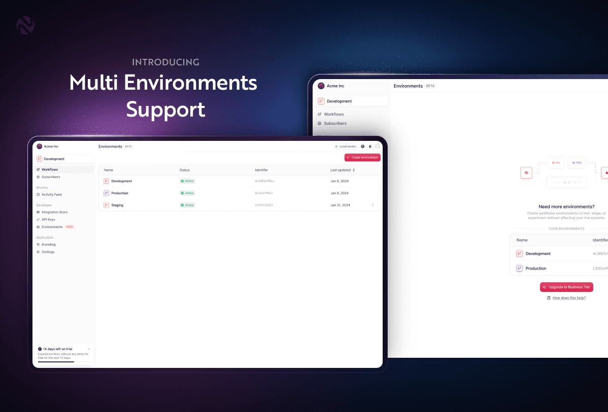
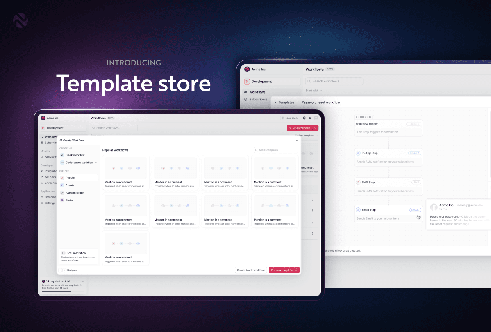
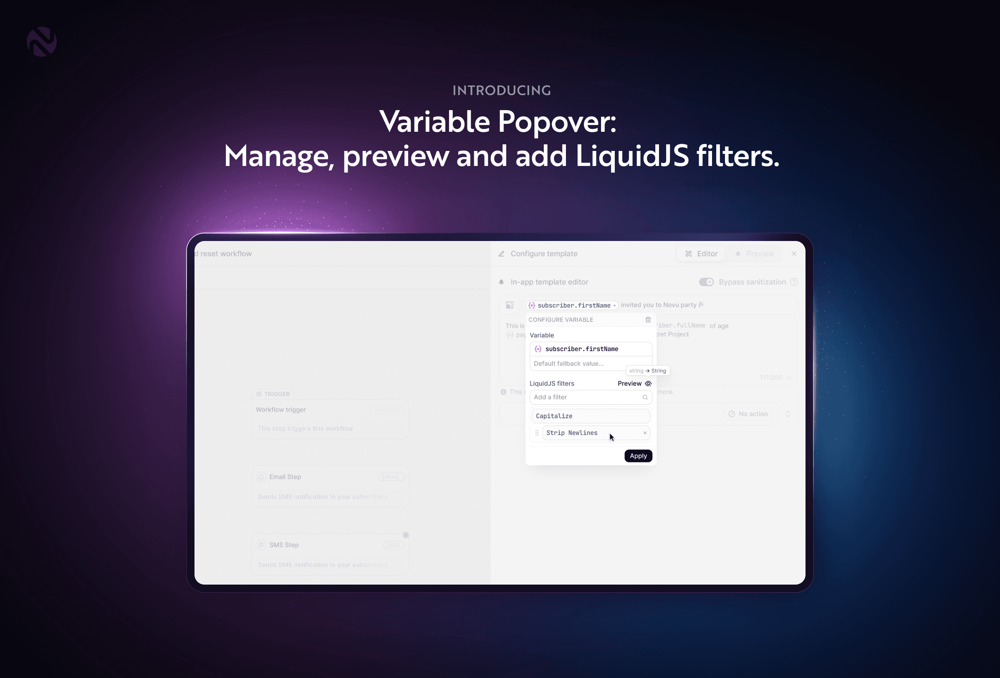
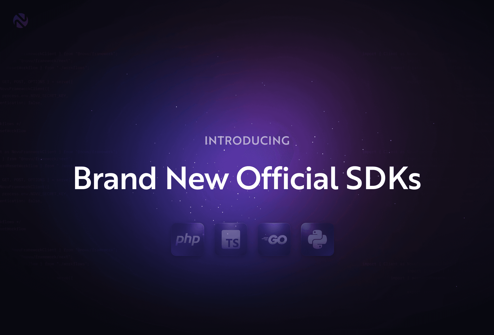
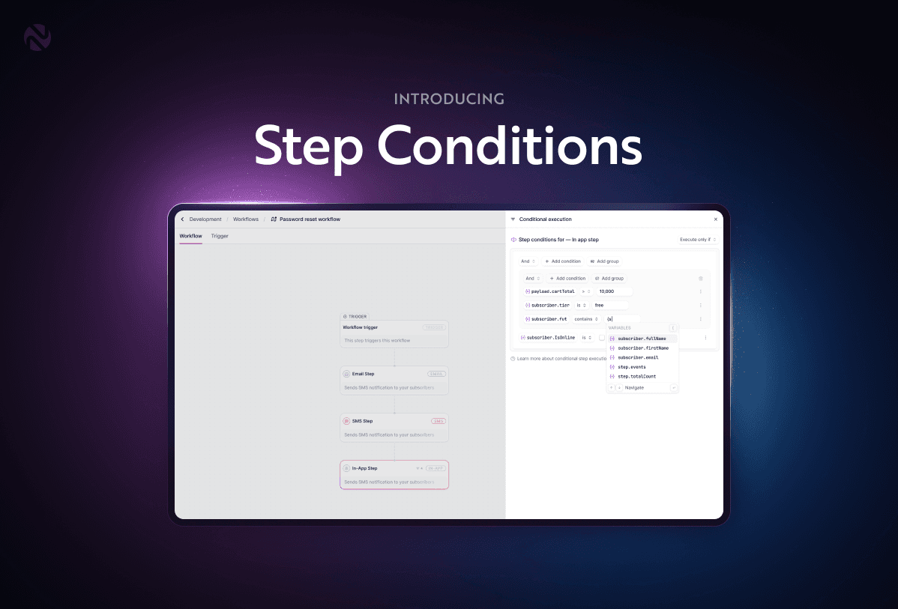

# 2025 Winter Season Launch Week

Over the past week, we've rolled out some of the most requested features to make notification management even more powerful and efficient. 

Whether you're improving your workflow organization, streamlining development, or customizing notifications dynamically, there's something for everyone in this feature-packed update.

---

## Multi-Environment Support

Managing notifications across environments can be complex, but it's essential for delivering seamless user experiences. 

Novu's **Multi-Environment Support** introduces a structured, secure, and efficient way to handle your notification workflows at every stage—from development to production.

### **Key Capabilities**

- **Isolated Environments**: Maintain separate subscriber lists, workflows, and message histories.
- **Environment-Specific Security**: Unique API keys and application identifiers for each environment.
- **Change Management**: Commit and promote updates across development, staging, and production.
- **Custom Environments**: Create additional environments (e.g., QA, Sandbox) for greater flexibility.

Try it out and share your feedback: [Multi-Environment Support](https://go.novu.co/dashboard?utm_campaign=winter-season-lw?utm_source=novublog)

---

## Template Store

Building notification workflows from scratch can be repetitive. 

The **Novu Workflow Template Store** provides a library of pre-built, standardized notification workflows for use cases like **account security**, **user engagement**, **transactional updates**, and **system alerts**.

### **Why Use Workflow Templates?**

- **Save time**: Start with proven, industry-standard workflows.
- **Ensure consistency**: Maintain uniform communication patterns.
- **Multi-channel support**: Works across email, SMS, push, and chat.
- **Evolving library**: More templates are being added regularly.

**Request a new template or get started today:** [Submit a Workflow Template Request](https://go.novu.co/5WLqNp9)

---

## Variable Popover

The **Variable Popover** makes dynamic content creation in Novu's dashboard effortless—no need to manually write **Liquid syntax** anymore! 

Now, you can **pick, configure, and preview variables directly in the UI**.

### **Key Benefits**

- **No more Liquid syntax** – Use an intuitive UI to insert variables.
- **Live Previews** – Instantly see how variables render.
- **Error-Free Transformations** – Apply filters (capitalization, date formatting, etc.) with ease.
- **Quick Modifications** – Adjust formats and set default values on the fly.

**Experience it in action:** [Try it now](https://go.novu.co/dashboard?utm_campaign=winter-season-lw?utm_source=novublog)

---

## Auto-Genarated SDKs for TypeScript, Python, Go, and PHP

We’re excited to introduce **official Novu SDKs** for **TypeScript, Python, Go, and PHP**! These SDKs make it seamless to integrate **enterprise-grade notifications** into any application.

### **What’s New?**

- **Fully typed APIs**: Ensuring robust, error-free development.
- **Idiomatic support**: Designed with best practices for each language.
- **Multi-channel capabilities**: Send notifications via email, SMS, push, in-app, and chat.
- **Live API Playground**: Test and interact with Novu’s API instantly.

**Get started with the SDKs:**

- [TypeScript SDK](https://go.novu.co/ts?utm_source=release_notes)
- [Python SDK](https://go.novu.co/python?utm_source=release_notes)
- [Go SDK](https://go.novu.co/go?utm_source=change_log)
- [PHP SDK](https://go.novu.co/php?utm_source=change_log)

---

## Step Conditions

**Step Conditions** bring full customization to your workflows, enabling notifications to be triggered based on **subscriber data**, **payload information**, and **previous step outcomes**.

### **Key Features**

- **Subscriber-Based Conditions**: Target users based on `locale`, `isOnline`, or `lastOnlineAt`.
- **Payload-Driven Conditions**: Define actions based on real-time trigger data.
- **Outcome-Based Conditions**: Trigger escalations if previous notifications go unread.
- **Advanced Logic**: Use **AND**, **OR**, and nested conditions for complex workflows.
- **Expanded Operator Library**: Comparison, string-based, and range-based filtering.

**Explore Step Conditions today:** [Learn More](https://go.novu.co/ZgpNMxU?utm_source=novublog)

---

## What’s Next?

These updates are just the beginning! We’re continuously improving Novu to provide the best experience for notification workflows. 

Stay tuned for even more enhancements, and let us know what features you’d love to see next.

🚀 **Get started today and take your notification workflows to the next level!**