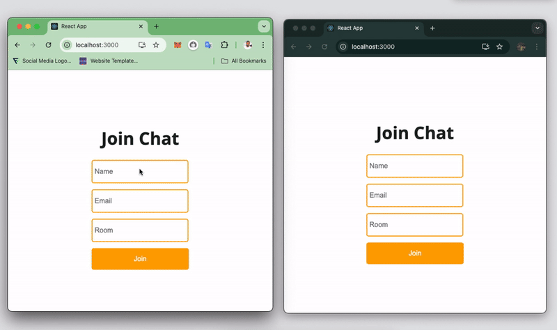

# Real-time Notification System with Socket.IO and ReactJS

This repository contains the source code for a real-time notification system built with Socket.IO and ReactJS. This system allows users to join chat rooms and receive instant notifications about new messages and user activity. Additionally, administrators can receive email alerts whenever a new user joins a room.

## Prerequisites

- Node.js installed on your machine
- Basic understanding of ReactJS and Socket.IO

## Features

Users can join chat rooms.
Users can send and receive messages in real-time.
Users receive a notification when a new user joins the room. (Alert box)
Administrators receive email notifications (via Novu) when a new user joins the room.

## Technology Stack

Frontend: ReactJS
Backend: Node.js, Express
Real-time communication: Socket.IO
Email notifications: Novu

## Project Structure

`server`: Contains the backend code for the application.
`client`: Contains the React frontend code for the application.
`.env`: (Optional) Stores the Novu secret key for email notifications.

## How it Works

Users connect to the backend server using Socket.IO.

Users can join chat rooms by providing a username and room name.

When a user joins a room, the server broadcasts a notification to all other users in the same room.

When a user sends a message, the server broadcasts the message to all users in the same room.

Users receive messages and notifications in real-time through Socket.IO listeners.

(Optional) When a user joins a room, the server triggers a Novu workflow that sends an email notification to the users.

## Customization

You can customize the email notification content and recipient email address in the server/index.js file.
You can further enhance the user interface and functionalities of the chat application.
Further Resources

Socket.IO: https://socket.io/docs/v4/
ReactJS: https://legacy.reactjs.org/docs/getting-started.html
Novu: https://novu.co/
